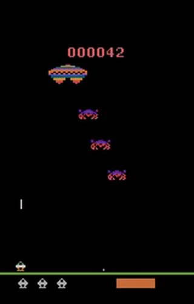

# Deep Q Network
## Paper
- [playing atari with deep reinforcement learning](https://www.cs.toronto.edu/~vmnih/docs/dqn.pdf) (NIPS 2013)
- [Human-Level Control through Deep Reinforcement Learning](https://www.nature.com/nature/journal/v518/n7540/full/nature14236.html) (NIPS 2015)


## TO DO

- Test: Atari
	- more complex ConvNet model
- use TensorBoard
	- average loss
	- average q
	- average reward (consecutive 100 episode)
	- episode reward

## Config

```bash
python main.py -h

  --discount_rate DISCOUNT_RATE
                        Initial discount rate.
  --replay_memory_length REPLAY_MEMORY_LENGTH
                        Number of replay memory episode.
  --target_update_count TARGET_UPDATE_COUNT
                        DQN Target Network update count.
  --max_episode_count MAX_EPISODE_COUNT
                        Number of maximum episodes.
  --batch_size BATCH_SIZE
                        Batch size. (Must divide evenly into the dataset
                        sizes)
  --frame_size FRAME_SIZE
                        Frame size. (Stack env's observation T-n ~ T)
  --model_name MODEL_NAME
                        DeepLearning Network Model name (MLPv1, ConvNetv1)
  --learning_rate LEARNING_RATE
                        Batch size. (Must divide evenly into the dataset
                        sizes)
  --gym_result_dir GYM_RESULT_DIR
                        Directory to put the gym results.
  --gym_env GYM_ENV     Name of Open Gym's enviroment name. (CartPole-v0,
                        CartPole-v1, MountainCar-v0)
  --step_verbose [STEP_VERBOSE]
                        verbose every step count
  --step_verbose_count STEP_VERBOSE_COUNT
                        verbose step count
```

## Model

### 1. MLPv1

- hidden layer (16, 64, 32)
- AdamOptimizer

### 2. ConvNetv1

- 3 Conv + MaxPool Layers (kernel_size [3, 3, 3], filters [32, 64, 128])
- 2 Fully Connected Layers (hidden_size [128, 32])
- AdamOptimizer

### 3. ConvNetv2

- 5 Conv + MaxPool Layers (kernel_size [7, 5, 3, 3, 3], filters [126, 256, 512, 512, 512]
- 2 Fully Connected Layers (hidden_size [1024, 256])
- AdamOptimizer

## Expertiments

### Classic control

| CartPole-v0 | CartPole-v1 | MountainCar-v0 |
| ------- | ----------- | ------------ |
| defines "solving" as getting average reward of **195.0** over 100 consecutive trials. | defines "solving" as getting average reward of **475.0** over 100 consecutive trials. | defines "solving" as getting average reward of **-110.0** over 100 consecutive trials. |
| **Model** : MLPv1 | **Model** : MLPv1 | **Model** : MLPv1 |
| **Clear** : after 177 episode | **Clear** : after 791 episode | **Clear** : after 1182 episode |  
|  |  |  |

### Atari

| Assault-ram-v0 |  
| ------- | 
| Maximize your score |  
| **Model** : ConvNetv2 | 
| **Score** : 421.12 (average from 100 consecutive trials) |
|  |
| 2000 Episode (Learn something.. but still stupid) |

| Breakout-ram-v0 |  |  |
| ------- | ----------- | ------------ |
| Maximize your score |  |  |
| **Model** : ConvNetv1 |  |  |
| **Score** : 9.69 (average from 100 consecutive trials) |  |  |  


## Reference

- Base code : [humkim/ReinforcementZeroToAll](https://github.com/hunkim/ReinforcementZeroToAll/blob/master/07_3_dqn_2015_cartpole.py)
