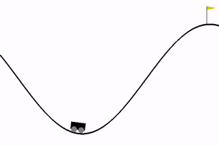

# Deep Q Network
## Paper
- [playing atari with deep reinforcement learning](https://www.cs.toronto.edu/~vmnih/docs/dqn.pdf) (NIPS 2013)
- [Human-Level Control through Deep Reinforcement Learning](https://www.nature.com/nature/journal/v518/n7540/full/nature14236.html) (NIPS 2015)

## TO DO

- Test: Atari
	- Stack Observation n frame
	- Fix X (input) placeholder
	- Get score > randome average score (base) * 5
	- need GPU setting

## Model

- optimizer : mean squared error

### 1. MLPv1

- hidden layer (16, 64, 32)
- AdamOptimizer

### 2. ConvNetv1

- Conv + Pool (3x3 kernel, 3 layer (32, 64, 128)
- Fully Connected Layer (2 layer (128, 32))
- AdamOptimizer

## Expertiments

### Classic control

| CartPole-v0 | CartPole-v1 | MountainCar-v0 |
| ------- | ----------- | ------------ |
| defines "solving" as getting average reward of **195.0** over 100 consecutive trials. | defines "solving" as getting average reward of **475.0** over 100 consecutive trials. | defines "solving" as getting average reward of **-110.0** over 100 consecutive trials. |
| **Model** : MLPv1 | **Model** : MLPv1 | **Model** : MLPv1 |
| **Clear** : after 177 episode | **Clear** : after 791 episode | **Clear** : after 1182 episode |  
|  |  |  |

### Atari

## Reference

- Base code : [humkim/ReinforcementZeroToAll](https://github.com/hunkim/ReinforcementZeroToAll/blob/master/07_3_dqn_2015_cartpole.py)
